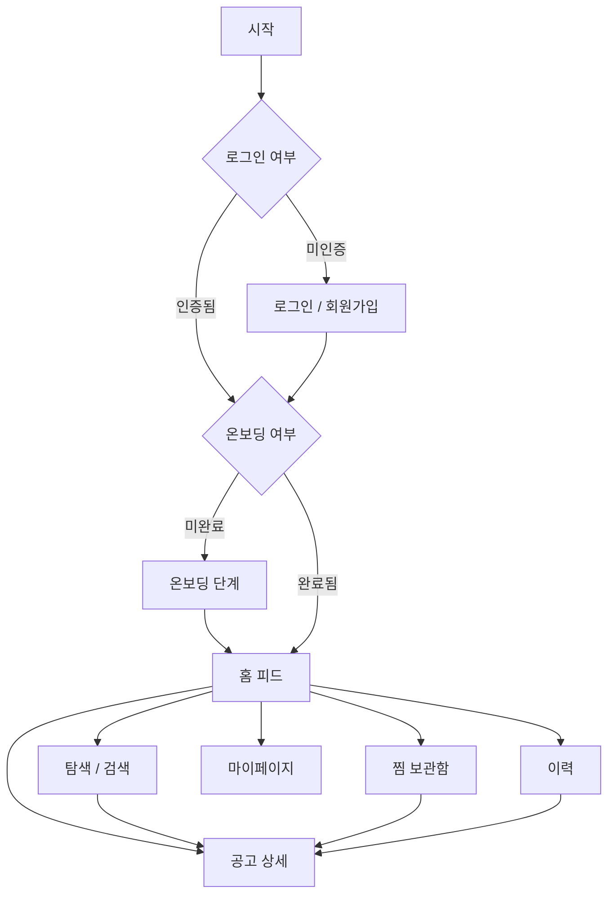

# 🧑‍🎄 FitMe Frontend

> **대학생 맞춤형 장학금 · 공모전 매칭 서비스 — FitMe 프론트엔드 레포지토리입니다.**

## 🛠 기술 스택


## 📂 폴더 구조

```text
frontend/
 ├ src/
 | ├ apis/
 | ├ constants/
 | ├ features/
 | ├ shared/
 | | ├ components/
 | | ├ hooks/
 | | └ utils/
 | ├ pages/
 | ├ routes/
 | ├ store/
 | ├ types/
 | ├ lib/
 └ package.json
```

## 🌿 브랜치 및 협업 전략

### 브랜치 전략

- **`main`**: 프로덕션 배포를 위한 브랜치.
- **`develop`**: 개발 중인 코드가 통합되는 중심 브랜치. PR을 통해서만 병합 가능.
- **`feature/기능명`**: 기능 개발을 진행하는 개별 작업 브랜치. (`develop`에서 분기)
  - _e.g: `feature/login`, `feature/posting-list`_

### 커밋 메시지 규칙

커밋 메시지는 `타입: 메시지 내용` 형식을 준수

| 타입       | 설명                             |
| :--------- | :------------------------------- |
| `feature`  | 새로운 기능 추가                 |
| `fix`      | 버그 수정                        |
| `docs`     | 문서 수정                        |
| `style`    | 코드 포맷팅, 세미콜론 누락 등    |
| `refactor` | 프로덕션 코드 리팩토링           |
| `test`     | 테스트 코드 추가 및 수정         |
| `chore`    | 빌드 업무, 패키지 매니저 설정 등 |

### Pull Request (PR) 및 코드 리뷰 컨벤션

- `feature/기능명` 브랜치에서 작업 완료 후 `develop` 브랜치로 PR을 보냄.
- 최소 **1명 이상의 팀원 승인**을 받아야만 `develop` 브랜치에 병합할 수 있음.
- 패키지가 추가/변경되었을 경우 PR 내용에 명시하고 팀원에게 공지할 것.

## 🚀 실행 방법

```bash
# 1. 저장소 클론 및 frontend 폴더 이동
cd frontend

# 2. 의존성 패키지 설치
pnpm install

# 4. 개발 서버 실행
pnpm dev

# 5. 코드 스타일 및 린트 검사
pnpm lint   # ESLint 검사
pnpm format # Prettier 포맷팅 자동 적용
```

## 📱 화면 목록 및 서비스 플로우

### 화면 목록

- **인증 및 온보딩**
  - `로그인 / 회원가입`: 이메일 기반 간편 가입
  - `온보딩`: 관심 키워드(장학금 분야, 공모전 분야 등) 선택
- **메인 서비스**
  - `홈 피드`: 맞춤 추천 공고(인기 공고, 마감 임박 공고 등 3가지 섹션)
  - `탐색 (검색)`: 키워드 검색 및 카테고리/주최기관 필터링
  - `공고 상세`: 상세 공고 포스터, 상세 정보 요약 및 원본 링크 제공
- **개인화 메뉴**
  - `찜 보관함`: 사용자가 관심 등록한 공고 목록
  - `마이페이지`: 온보딩 선택 정보 수정 및 설정
  - `이력`: 사용자가 지원한 공고 관리

### 페이지 이동 흐름 (Flow)



## 👥 팀원 및 역할 분담

| 이름                              | 역할            | 담당 기능 (R&R)          |
| :-------------------------------- | :-------------- | :----------------------- |
| **[서은호](https://github.com/)** | 프론트엔드 개발 | [담당 역할 및 기능 상세] |
| **[김경섭](https://github.com/)** | 프론트엔드 개발 | [담당 역할 및 기능 상세] |
| **[정종욱](https://github.com/)** | 프론트엔드 개발 | [담당 역할 및 기능 상세] |
